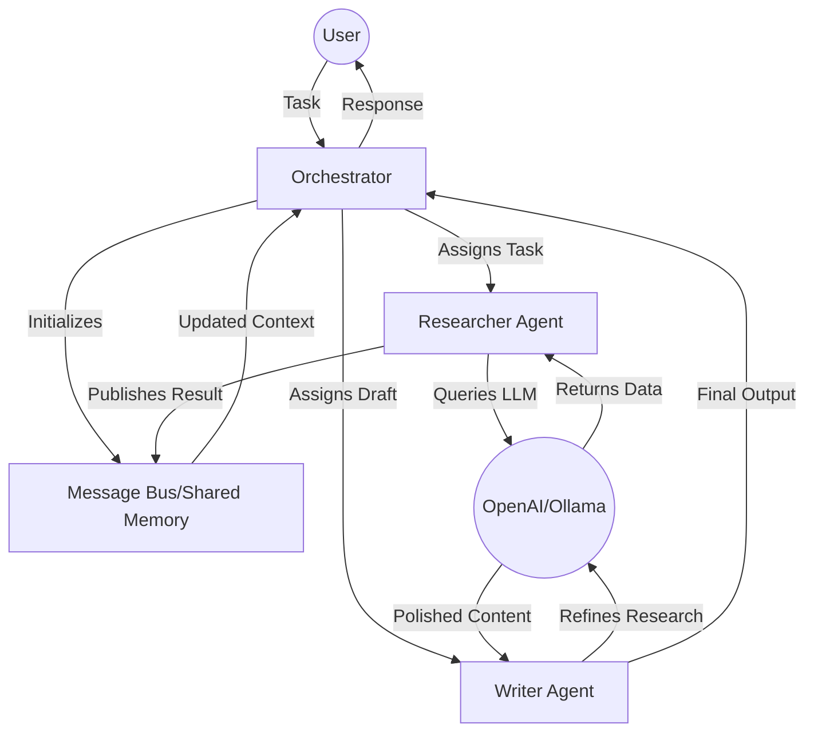
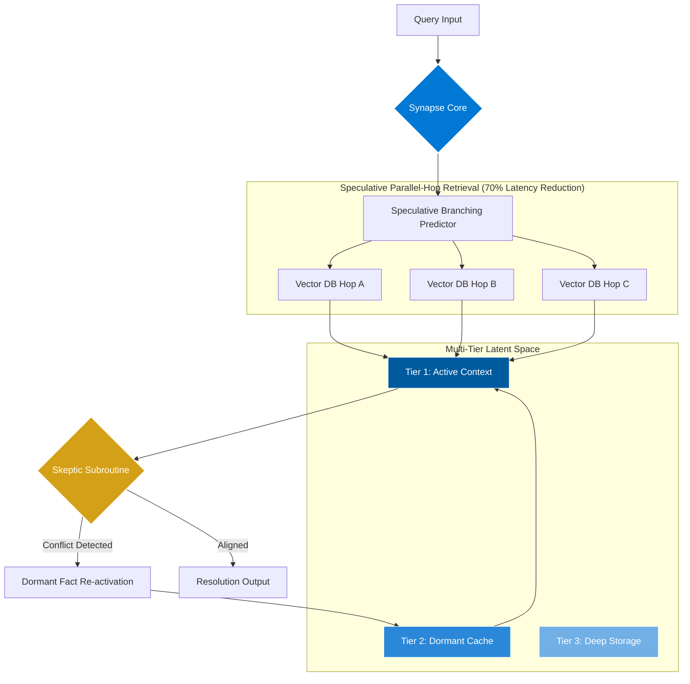

# Agentic Hyper-Graph Synapse (AHS) 🧠🕸️

 

**AHS Agentic** is a next-generation framework designed to move beyond volatile context windows toward a **Living, Probabilistic Graph State**. At the CTO level, AHS shifts the focus from prompt engineering to **Agentic Architecture**, solving the "Forensic Reconciliation Gap" for enterprise-scale medical, legal, and technical audits.

---

## 🔧 Technical Highlights

- **Stateful Orchestration**: Utilizes a centralized MessageBus to maintain conversation state across multiple agent turns.

- **Agent Autonomy**: Agents are decoupled from the LLM provider, allowing for easy switching between OpenAI, Anthropic, or Local Models.

- **Extensible Schema**: Built on the BaseAgent abstract class, making it easy to add specialized agents (e.g., CodingAgent, ReviewerAgent) in minutes.

---

## 🎨 Visualizing the Architecture

Below is a visual representation of how the system orchestrates tasks across agents:

---

## 🏗️ System Architecture

AHS replaces linear RAG with a **Synthetic Reasoning Architecture**. Below is the flow of the **Hyper-Graph Synapse**:

