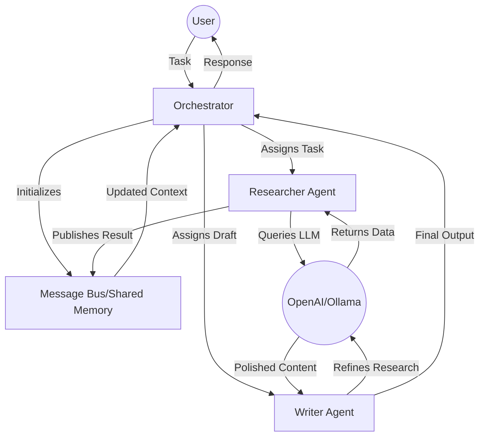

## 🔧 Technical Highlights

- **Stateful Orchestration**: Utilizes a centralized MessageBus to maintain conversation state across multiple agent turns.
- **Agent Autonomy**: Agents are decoupled from the LLM provider, allowing for easy switching between OpenAI, Anthropic, or Local Models.
- **Extensible Schema**: Built on the BaseAgent abstract class, making it easy to add specialized agents (e.g., CodingAgent, ReviewerAgent) in minutes.

## 🎨 Visualizing the Architecture

Below is a visual representation of how the system orchestrates tasks across agents:

