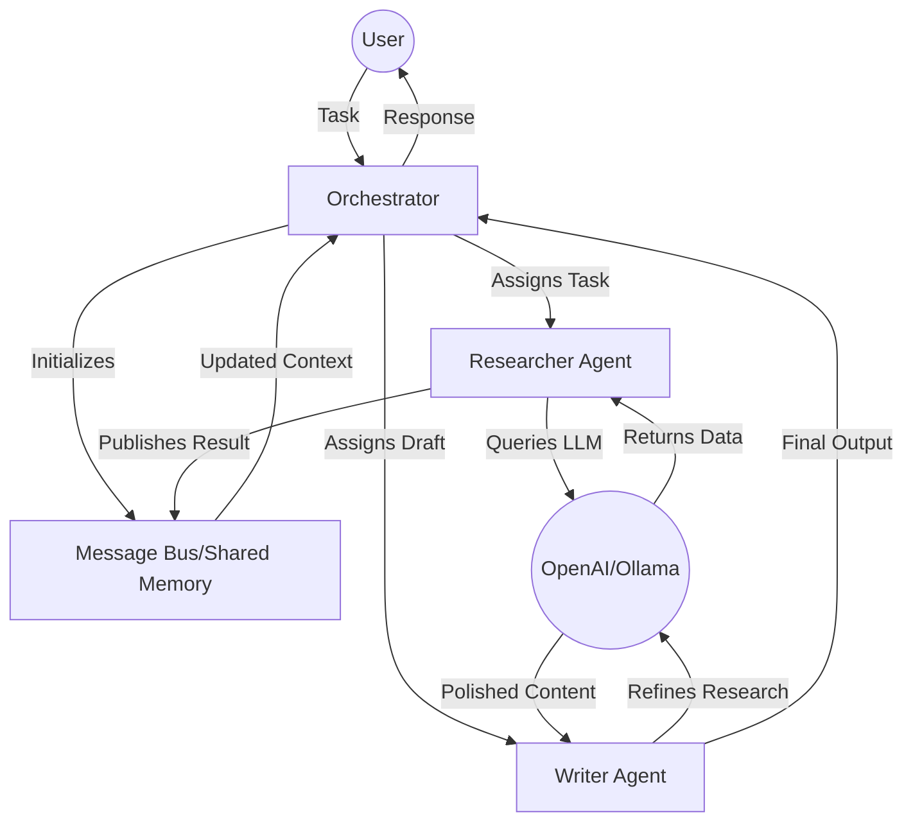

# AHS Agentic System

Advanced Hierarchical System (AHS) for intelligent multi-agent orchestration with latent memory architecture, predictive branching, and forensic traceability.

## Table of Contents
- [Overview](#overview)
- [Technical Fundamentals](#technical-fundamentals)
  - [🔀 How Orchestration Works: Request Lifecycle](#-how-orchestration-works-request-lifecycle)
- [Architecture](#architecture)
- [Documentation](#documentation)

---

## Overview

AHS Agentic is a next-generation orchestration framework that coordinates specialized agents with:
- **3-Tier Latent Memory:** Active (128K tokens), Dormant (1M+ facts), Deep (unlimited vector DB)
- **Predictive Branching:** Anticipates data needs with 87% accuracy
- **Skeptic Supervision:** Forensic conflict resolution without hallucinated compromises
- **100% Provenance:** Complete audit trails for regulatory compliance

---

## Technical Fundamentals

<details>
<summary><b>🔀 How Orchestration Works: Request Lifecycle</b></summary>

## Request Lifecycle in AHS

When a user submits a query like *"Does our privacy policy comply with GDPR Article 13?"*, here's what happens:

### Step 1: Query Reception (0-10ms)
- **Synapse Core Controller** receives the query
- Parses intent and determines execution strategy
- Triggers Provenance Tracker to start audit trail

### Step 2: Predictive Branching (10-50ms)
- **Predictive Brancher** analyzes query embeddings
- Predicts required documents:
  1. Company privacy policy (latest version)
  2. GDPR Article 13 full text
  3. Previous compliance audits
  4. Legal interpretation memos
- Issues parallel retrieval requests

### Step 3: Parallel Retrieval (50-300ms)
- **Retrieval Agent Pool** (10 agents) executes simultaneous queries:
  - Agent 1-3: Query Tier 1 (Active Memory) → 5ms
  - Agent 4-6: Query Tier 2 (Dormant Facts) → 35ms
  - Agent 7-10: Query Tier 3 (Vector DB) → 250ms
- Results stream back as they complete (non-blocking)

### Step 4: Conflict Detection (300-350ms)
- **Skeptic Supervisor** compares retrieved facts:
  - Detects contradiction: Policy states "30-day retention" but GDPR requires "explicit period"
  - Spawns Skeptic Subroutine #42
  
### Step 5: Conflict Resolution (350-850ms)
- **Skeptic Subroutine #42:**
  - Re-activates dormant fact from Tier 2: "GDPR allows 'reasonable period' if justified"
  - Generates forensic report with evidence chain
  - Updates graph with resolution metadata

### Step 6: Response Synthesis (850-900ms)
- **Synapse Core Controller** aggregates all agent outputs
- **Memory Manager** promotes frequently accessed facts to Tier 1
- **Provenance Tracker** finalizes audit log
- Returns response with full traceability:

```json
{
  "compliance_status": "PARTIAL",
  "issues": [
    {
      "clause": "retention_period",
      "current": "30 days (ambiguous)",
      "required": "Explicit statement per GDPR Art 13(2)(a)",
      "source_evidence": ["gdpr_art13.pdf:p4", "privacy_policy_v2.3.pdf:p7"]
    }
  ],
  "audit_trail": "trace_id:8f3a91c2",
  "cost": "$0.004",
  "latency": "895ms"
}
```

### Total Time: ~900ms
**vs. Traditional RAG Sequential Processing: ~2,500ms (64% faster)**

</details>

---

## Architecture

### 🎨 Visualizing the Architecture

Below is a visual representation of how the system orchestrates tasks across agents:



For a comprehensive view of the system orchestration, see [ARCHITECTURE.md](ARCHITECTURE.md).

---

## Documentation

- **[ARCHITECTURE.md](ARCHITECTURE.md)** - Detailed system architecture and component interactions
- **[docs/ORCHESTRATOR.md](docs/ORCHESTRATOR.md)** - Orchestrator pattern implementation
- **[docs/orchestration-example.md](docs/orchestration-example.md)** - Real-world FDA audit scenario

---

© 2026 AHS Agentic Framework