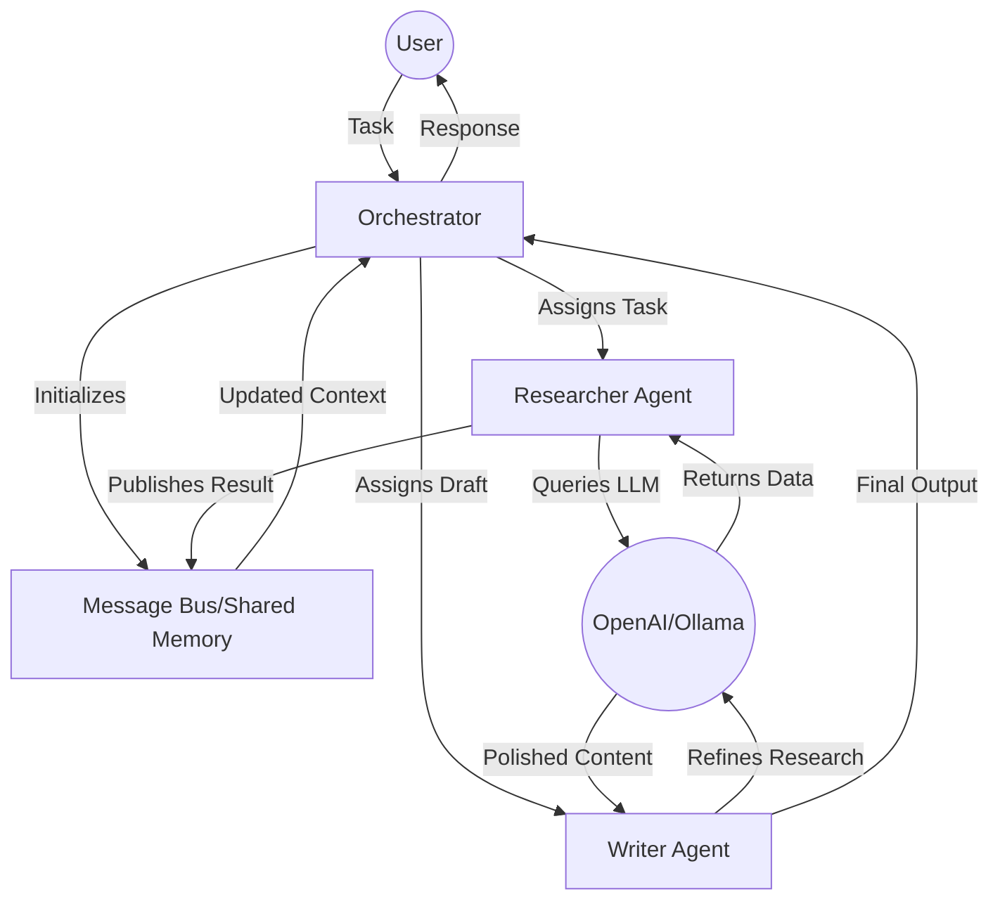

## 🎨 Visualizing the Architecture

Below is a visual representation of how the system orchestrates tasks across agents:

```mermaid
graph TD
    User((User)) -->|Task| O[Orchestrator]
    O -->|Initializes| MB[Message Bus/Shared Memory]
    O -->|Assigns Task| R[Researcher Agent]
    R -->|Queries LLM| LLM((OpenAI/Ollama))
    LLM -->|Returns Data| R
    R -->|Publishes Result| MB
    MB -->|Updated Context| O
    O -->|Assigns Draft| W[Writer Agent]
    W -->|Refines Research| LLM
    LLM -->|Polished Content| W
    W -->|Final Output| O
    O -->|Response| User
```