# Agentic Hyper-Graph Synapse (AHS) 🧠🕸️

 

**AHS Agentic** is a next-generation framework designed to move beyond volatile context windows toward a **Living, Probabilistic Graph State**. At the CTO level, AHS shifts the focus from prompt engineering to **Agentic Architecture**, solving the "Forensic Reconciliation Gap" for enterprise-scale medical, legal, and technical audits.

---

## 🎨 Visual Architecture

### How Tasks Flow Through AHS

```mermaid
graph TB
    User([👤 User/Application])
    
    subgraph "🎯 Orchestration Layer"
        Orchestrator[🎭 Orchestrator<br/>Manages agents & routes tasks]
        SharedMemory[(🧠 Shared Memory<br/>Context across sessions)]
        Router{🔀 Smart Router<br/>Route to agent or broadcast?}
    end
    
    subgraph "🔬 Research Agents"
        R1[📚 Researcher 1<br/>Document Analysis]
        R2[🌐 Researcher 2<br/>Web Search]
        R3[📊 Researcher 3<br/>Data Mining]
    end
    
    subgraph "✍️ Writer Agents"
        W1[📝 Writer 1<br/>Technical Writer]
        W2[📰 Writer 2<br/>Content Writer]
        W3[📋 Writer 3<br/>Report Generator]
    end
    
    subgraph "🛡️ Quality Layer"
        Skeptic[🤔 Skeptic Agent<br/>Conflict Detection]
        HITL[👨‍💼 Human-in-the-Loop<br/>Final Review]
    end
    
    Output([📤 Final Output<br/>With Provenance])
    
    User -->|Task Request| Orchestrator
    Orchestrator --> SharedMemory
    Orchestrator --> Router
    
    Router -->|Research Task| R1
    Router -->|Research Task| R2
    Router -->|Research Task| R3
    
    R1 -->|Findings| SharedMemory
    R2 -->|Findings| SharedMemory
    R3 -->|Findings| SharedMemory
    
    SharedMemory -->|Context| W1
    SharedMemory -->|Context| W2
    SharedMemory -->|Context| W3
    
    W1 -->|Draft| Skeptic
    W2 -->|Draft| Skeptic
    W3 -->|Draft| Skeptic
    
    Skeptic -->|Confidence < 0.85| HITL
    HITL -->|Approved| Output
    Skeptic -->|Confidence ≥ 0.85| Output
    
    Output -->|Result + Audit Trail| User
    
    style User fill:#2D5BFF,color:#fff,stroke:#fff,stroke-width:2px
    style Orchestrator fill:#FF6B35,color:#fff,stroke:#fff,stroke-width:2px
    style SharedMemory fill:#50FA7B,color:#000,stroke:#fff,stroke-width:2px
    style Router fill:#FFB86C,color:#000,stroke:#fff,stroke-width:2px
    style R1 fill:#8BE9FD,color:#000,stroke:#fff,stroke-width:2px
    style R2 fill:#8BE9FD,color:#000,stroke:#fff,stroke-width:2px
    style R3 fill:#8BE9FD,color:#000,stroke:#fff,stroke-width:2px
    style W1 fill:#BD93F9,color:#fff,stroke:#fff,stroke-width:2px
    style W2 fill:#BD93F9,color:#fff,stroke:#fff,stroke-width:2px
    style W3 fill:#BD93F9,color:#fff,stroke:#fff,stroke-width:2px
    style Skeptic fill:#FF79C6,color:#fff,stroke:#fff,stroke-width:2px
    style HITL fill:#F1FA8C,color:#000,stroke:#fff,stroke-width:2px
    style Output fill:#50FA7B,color:#000,stroke:#fff,stroke-width:2px
```

**Key Features Shown:**
- 🎭 **Orchestrator** routes tasks intelligently
- 🔬 **Research Agents** work in parallel
- ✍️ **Writer Agents** use shared context
- 🛡️ **Skeptic** validates results
- 👨‍💼 **Human-in-the-Loop** for critical decisions

---

### Sequential Execution Flow

```mermaid
sequenceDiagram
    actor User
    participant Orch as 🎭 Orchestrator
    participant Mem as 🧠 Shared Memory
    participant R as 🔬 Research Agents
    participant W as ✍️ Writer Agents
    participant S as 🛡️ Skeptic
    participant H as 👨‍💼 Human Reviewer
    
    User->>Orch: Submit Task:<br/>"Write compliance report"
    
    Note over Orch: Initialize<br/>Shared Context
    Orch->>Mem: Create session context
    
    Note over Orch,R: Phase 1: Research
    Orch->>R: Parallel dispatch:<br/>3 research tasks
    
    par Parallel Research
        R->>R: Research regulations
    and
        R->>R: Analyze policies
    and
        R->>R: Gather precedents
    end
    
    R->>Mem: Store findings<br/>(Tier 1: Active)
    
    Note over Orch,W: Phase 2: Writing
    Mem->>W: Provide context<br/>+ research findings
    Orch->>W: Generate report sections
    
    par Parallel Writing
        W->>W: Write executive summary
    and
        W->>W: Write analysis section
    and
        W->>W: Write recommendations
    end
    
    W->>S: Submit drafts
    
    Note over S: Conflict Detection
    S->>S: Check for contradictions
    S->>S: Validate sources
    S->>S: Calculate confidence: 0.78
    
    alt Confidence < 0.85
        S->>H: Escalate for review<br/>⚠️ Low confidence
        H->>H: Review conflicts
        H->>S: Approve with notes
    else Confidence ≥ 0.85
        S->>Orch: Auto-approve
    end
    
    S->>Orch: Finalized report<br/>+ Provenance chain
    Orch->>User: ✅ Report delivered<br/>🔗 Full audit trail
    
    Note over User,Orch: 100% Traceable<br/>Every decision logged
```

**Timeline shows:**
1. ⚡ **Parallel research** (3 agents simultaneously)
2. 📝 **Parallel writing** (context-aware)
3. 🛡️ **Automatic validation** with confidence scores
4. 👨‍💼 **Human escalation** when confidence < 0.85
5. 📊 **Full provenance** trail for audits

---

### Multi-Model Support

**Choose your model:**
- 🟢 **OpenAI GPT-4** - Best for reasoning
- 🟠 **Anthropic Claude** - Best for writing
- 🟣 **Ollama Llama 3** - Best for cost (local)

---

### Memory Architecture

```mermaid
graph TD
    Query[User Query]
    
    subgraph "🧠 Multi-Tier Memory System"
        subgraph "⚡ Tier 1: Active Memory"
            T1[(128K tokens<br/>~0ms latency<br/>Current session)]
        end
        
        subgraph "💤 Tier 2: Dormant Cache"
            T2[(1M+ facts<br/>~10ms latency<br/>Recently used)]
        end
        
        subgraph "🗄️ Tier 3: Deep Storage"
            T3[(Unlimited<br/>~50ms latency<br/>Vector DB)]
        end
    end
    
    Query --> T1
    T1 -->|Cache miss| T2
    T2 -->|Not found| T3
    
    T3 -->|Promote| T2
    T2 -->|Activate| T1
    
    T1 -->|Demote low-salience| T2
    T2 -->|Archive old data| T3
    
    T1 --> Result[Fast Response<br/>with Context]
    
    style Query fill:#2D5BFF,color:#fff
    style T1 fill:#50FA7B,color:#000,stroke:#fff,stroke-width:3px
    style T2 fill:#F1FA8C,color:#000,stroke:#fff,stroke-width:3px
    style T3 fill:#FF79C6,color:#fff,stroke:#fff,stroke-width:3px
    style Result fill:#50FA7B,color:#000
```

**3-Tier Memory = 60% Cost Savings:**
- **Tier 1**: Instant access (0ms)
- **Tier 2**: Cached facts (10ms)
- **Tier 3**: Deep storage (50ms)

**Why this matters:** Unlike ChatGPT which "forgets" between sessions, AHS remembers everything efficiently.

---

## 🏗️ System Architecture

AHS replaces linear RAG with a **Synthetic Reasoning Architecture**. Below is the flow of the **Hyper-Graph Synapse**:

---

### ⭐ If AHS helps your project, give us a star! ⭐

