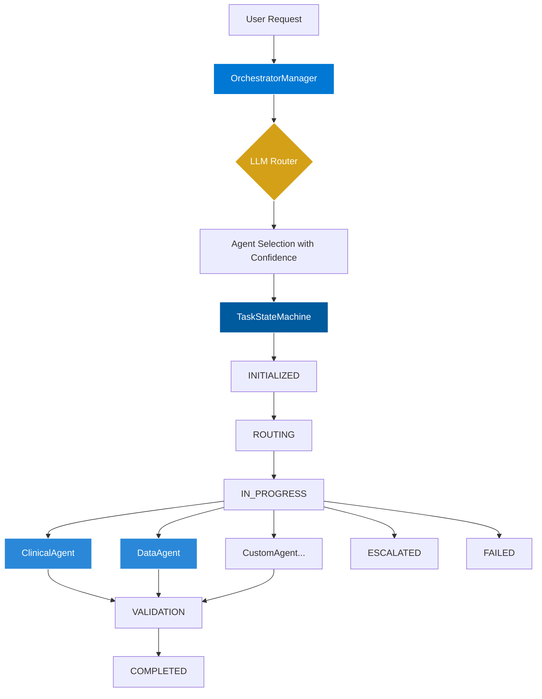

# Orchestrator Pattern: LLM-Guided Multi-Agent System

## Overview

The AHS Orchestrator implements a **Manager pattern** where an LLM-guided orchestrator intelligently routes tasks to specialized agents based on conversation context. This replaces monolithic agents with a modular, scalable architecture.

## Architecture



## Core Components

### 1. OrchestratorManager

The central hub that coordinates all agent interactions.

**Key Features:**
- LLM-guided agent selection with confidence scoring
- Conversation history tracking for context-aware decisions
- Performance metrics collection
- Automatic escalation for high-risk scenarios
- Support for custom agent registration

**Example:**
```python
from ahs_agentic import OrchestratorManager, ClinicalAgent, DataAgent

# Initialize manager
manager = OrchestratorManager(llm_provider="openai")

# Register specialized agents
manager.register_agent(ClinicalAgent())
manager.register_agent(DataAgent())

# Route a task
result = manager.route_task(
    task_id="task_001",
    user_request="Check drug interactions for warfarin",
    conversation_history=[]
)

print(f"Routed to: {result['agent']}")
print(f"Confidence: {result['confidence']}")
```

### 2. TaskStateMachine

Tracks task progression through 9 distinct states with full audit trail.

**State Flow:**
```
INITIALIZED → ROUTING → IN_PROGRESS → [AWAITING_DATA | ESCALATED | VALIDATION] → [COMPLETED | FAILED | CANCELLED]
```

**Valid Transitions:**
| From State | Valid Next States |
|------------|------------------|
| INITIALIZED | ROUTING, FAILED, CANCELLED |
| ROUTING | IN_PROGRESS, FAILED, CANCELLED |
| IN_PROGRESS | AWAITING_DATA, ESCALATED, VALIDATION, COMPLETED, FAILED |
| AWAITING_DATA | IN_PROGRESS, FAILED, CANCELLED |
| ESCALATED | IN_PROGRESS, FAILED, COMPLETED |
| VALIDATION | COMPLETED, FAILED, IN_PROGRESS |
| COMPLETED | (terminal) |
| FAILED | (terminal) |
| CANCELLED | (terminal) |

**Example:**
```python
from ahs_agentic import TaskStateMachine, TaskState

# Create state machine
sm = TaskStateMachine(task_id="task_001")

# Transition through states
sm.transition_to(TaskState.ROUTING, metadata={"agent": "ClinicalAgent"})
sm.transition_to(TaskState.IN_PROGRESS)
sm.transition_to(TaskState.COMPLETED)

# Check state
print(f"Current: {sm.get_current_state()}")
print(f"Is terminal: {sm.is_terminal_state()}")

# Get full history
history = sm.get_state_history()
for transition in history:
    print(f"{transition['from_state']} → {transition['to_state']}")
```

### 3. BaseAgent

Abstract base class for all specialized agents.

**Required Methods:**
```python
class CustomAgent(BaseAgent):
    def __init__(self):
        super().__init__(
            name="CustomAgent",
            specialty="Custom Domain",
            capabilities=["capability_1", "capability_2"]
        )
    
    def execute(self, request, conversation_history):
        # Implement your agent logic
        return {
            "result": {...},
            "summary": "Task completed",
            "requires_escalation": False,
            "metadata": {}
        }
```

**Performance Tracking:**
All agents automatically track:
- Total executions
- Success/failure counts
- Average execution time
- Success rate

```python
metrics = agent.get_performance_metrics()
print(f"Success rate: {metrics['success_rate']:.1%}")
print(f"Avg time: {metrics['avg_execution_time_seconds']:.3f}s")
```

## Specialized Agents

### ClinicalAgent

Handles medical and pharmaceutical queries.

**Capabilities:**
- Drug interaction checking
- Medical terminology interpretation
- Clinical protocol validation
- HIPAA compliance verification
- Adverse event detection
- Dosage verification

**Example:**
```python
from ahs_agentic import ClinicalAgent

agent = ClinicalAgent()

result = agent.execute(
    "Check interactions between warfarin and aspirin",
    conversation_history=[]
)

if result['requires_escalation']:
    print(f"⚠️ Escalation: {result['escalation_reason']}" )
```

**Escalation Triggers:**
- Adverse events detected
- Dangerous keyword usage ("self-medicate", "skip dose")
- High-severity drug interactions

### DataAgent

Handles data processing and analysis tasks.

**Capabilities:**
- Data extraction from documents
- Data validation (email, phone, dates, etc.)
- Format transformation (CSV, JSON, XML)
- Statistical analysis
- Data cleaning and normalization
- Quality assessment

**Example:**
```python
from ahs_agentic import DataAgent

agent = DataAgent()

result = agent.execute(
    "Extract emails and dates from patient records",
    conversation_history=[]
)

extracted = result['result']['data']
print(f"Found: {extracted}")
```

**Quality Grading:**
| Score Range | Grade | Action |
|-------------|-------|--------|
| 0.9 - 1.0 | A | No action needed |
| 0.8 - 0.9 | B | Minor improvements |
| 0.7 - 0.8 | C | Improvements recommended |
| 0.6 - 0.7 | D | Escalate for review |
| < 0.6 | F | Escalate immediately |

## LLM-Guided Routing

The orchestrator uses an LLM to select the best agent for each task.

### Selection Algorithm

1. **Build Context:** Gather agent capabilities and conversation history
2. **Keyword Matching:** Score agents based on keyword overlap
3. **Specialty Matching:** Bonus for specialty alignment
4. **Context Bonus:** Recent agent usage in conversation
5. **Confidence Threshold:** Require minimum 0.3 confidence

**Confidence Scoring:**
```python
score = 0.0

# Keyword match: +0.3 per capability
for capability in agent.capabilities:
    if capability in request:
        score += 0.3

# Specialty match: +0.4
if agent.specialty in request:
    score += 0.4

# Context bonus: +0.2
if agent_name in recent_conversation:
    score += 0.2

confidence = min(score, 1.0)
```

### Custom LLM Integration

Replace the mock router with a real LLM:

```python
from openai import OpenAI

class LLMOrchestratorManager(OrchestratorManager):
    def __init__(self):
        super().__init__(llm_provider="openai")
        self.client = OpenAI()
    
    def _select_agent_with_llm(self, user_request, conversation_history):
        agent_list = "\n".join([
            f"- {agent.name}: {agent.specialty}"
            for agent in self.agents.values()
        ])
        
        prompt = f"""
        Available Agents:
        {agent_list}
        
        User Request: {user_request}
        
        Which agent should handle this request? Return the agent name and confidence (0-1).
        """
        
        response = self.client.chat.completions.create(
            model="gpt-4",
            messages=[{"role": "user", "content": prompt}]
        )
        
        # Parse response and return (agent, confidence)
        ...
```

## Performance Metrics

Track orchestrator performance across all tasks:

```python
metrics = manager.get_routing_metrics()

print(f"Total tasks: {metrics['total_tasks']}")
print(f"Avg confidence: {metrics['average_confidence']:.2f}")
print(f"Escalation rate: {metrics['escalation_rate']:.1%}")

for agent_name, count in metrics['agent_distribution'].items():
    print(f"  {agent_name}: {count} tasks")
```

**Key Metrics:**
- **Total Tasks:** Number of tasks processed
- **Agent Distribution:** Tasks per agent
- **Average Confidence:** Mean routing confidence
- **Escalation Rate:** % of tasks requiring human review

## Best Practices

### 1. Agent Design

✅ **DO:**
- Keep agents focused on a single domain
- Implement comprehensive error handling
- Return structured response dictionaries
- Track performance metrics
- Validate inputs before processing

❌ **DON'T:**
- Create overly broad agents
- Mix unrelated capabilities
- Return unstructured strings
- Ignore escalation scenarios

### 2. State Management

✅ **DO:**
- Always use state machines for task tracking
- Add metadata to transitions
- Check for terminal states
- Handle failed transitions gracefully

❌ **DON'T:**
- Skip state validation
- Transition directly to terminal states
- Ignore state history

### 3. Escalation Strategy

**When to Escalate:**
- Patient safety concerns
- Data quality below threshold
- High uncertainty (confidence < 0.5)
- Regulatory compliance issues
- Contradictory information

**Escalation Pattern:**
```python
def execute(self, request, conversation_history):
    # ... process request ...
    
    if should_escalate:
        return {
            "result": partial_result,
            "summary": "Partial processing complete",
            "requires_escalation": True,
            "escalation_reason": "Detailed explanation",
            "metadata": {
                "risk_level": "high",
                "recommended_reviewer": "clinical_supervisor"
            }
        }
```

## Testing

Run the comprehensive test suite:

```bash
# Run all tests
pytest tests/test_orchestrator.py -v

# Run specific test class
pytest tests/test_orchestrator.py::TestOrchestratorManager -v

# Run with coverage
pytest tests/test_orchestrator.py --cov=src/ahs_agentic/orchestrator
```

**Test Coverage:**
- ✅ State machine transitions (valid & invalid)
- ✅ Agent registration and routing
- ✅ Performance tracking
- ✅ Escalation flows
- ✅ Conversation history
- ✅ Metrics collection

## Examples

See `examples/orchestrator_example.py` for complete working demos:

```bash
python examples/orchestrator_example.py
```

**Included Examples:**
1. Clinical drug interaction query
2. Data extraction task
3. Adverse event escalation
4. Context-aware routing with history

## Roadmap

- [ ] **Phase 1:** Real LLM integration (OpenAI, Anthropic)
- [ ] **Phase 2:** Additional agents (LegalAgent, ComplianceAgent, FinancialAgent)
- [ ] **Phase 3:** Human-in-the-loop for escalated tasks
- [ ] **Phase 4:** Multi-turn conversation management
- [ ] **Phase 5:** Agent learning from feedback

## Contributing

To add a new agent:

1. Subclass `BaseAgent`
2. Implement `execute()` method
3. Define capabilities and specialty
4. Add unit tests
5. Update documentation

Example PR checklist:
- [ ] Agent implements BaseAgent
- [ ] Execute method returns proper structure
- [ ] Validation logic included
- [ ] Unit tests added (>80% coverage)
- [ ] Example added to docs
- [ ] Performance metrics tracked

---

© 2026 AHS Agentic Framework | Orchestrator Pattern Documentation